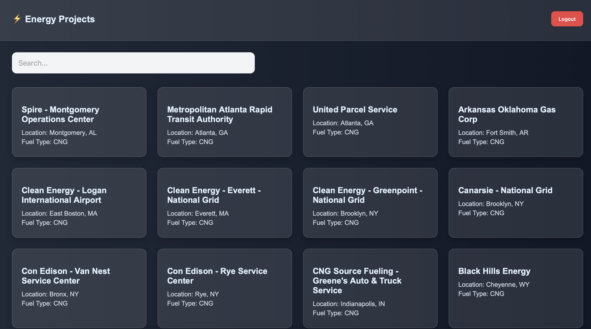

# ⚡ Renewable Energy Projects App

A full-stack web application built with the **MERN stack** to browse renewable energy projects using data from the NREL API. It includes authentication, search, pagination, and a modern UI.

---

## 🚀 Tech Stack

**Frontend**

- React (JavaScript)
- Vite
- React Router DOM
- Axios
- CSS (Custom, responsive)

**Backend**

- Node.js
- Express
- MongoDB (via Mongoose)
- JWT for authentication
- bcrypt for password hashing

**Data Source**

- [NREL Alt Fuel Stations API](https://developer.nrel.gov/docs/transportation/alt-fuel-stations-v1/)

---

## 📦 Features

- 🔐 User Authentication (Register & Login)
- 🧠 JWT-based session management
- 🌱 Project listing with data from NREL
- 🔍 Search with debounce
- 📄 Project detail view
- 📚 Pagination
- 🌈 Modern, responsive UI

---

## 📂 Folder Structure

```
Renewable/
├── backend/
│   ├── controllers/
│   │   └── authController.js
│   ├── middleware/
│   │   └── authMiddleware.js
│   ├── models/
│   │   └── User.js
│   ├── routes/
│   │   ├── authRoutes.js
│   │   └── projectRoutes.js
│   ├── server.js
│   └── .env
│
├── Frontend/
│   ├── index.html
│   ├── vite.config.js
│   ├── package.json
│   ├── public/
│   │   └── vite.svg
│   ├── src/
│   │   ├── App.jsx
│   │   ├── App.css
│   │   ├── auth.js
│   │   ├── index.css
│   │   ├── main.jsx
│   │   ├── styles/
│   │   ├── components/
│   │   │   ├── Navbar.jsx
│   │   │   └── ProjectCard.jsx
│   │   ├── pages/
│   │   │   ├── Login.jsx
│   │   │   ├── Register.jsx
│   │   │   ├── Projects.jsx
│   │   │   └── ProjectDetail.jsx
│   │   └── ProtectedRoute.jsx
│   └── README.md
```

---

## 🔧 Setup Instructions

### 1. Clone the repo

```bash
git clone https://github.com/Akshit945/RenewableProject.git
cd RenewableProject
```

### 2. Backend Setup

```bash
cd backend
npm install

# Create .env
MONGO_URI=mongodb://localhost:27017/renewable-app
JWT_SECRET=your_secret_key
PORT=3000

npm run dev
```

### 3. Frontend Setup

```bash
cd ../Frontend
npm install
npm run dev
```
# Create .env
VITE_API_URL=[http://localhost:3000]http://localhost:3000
 
Open [http://localhost:5173](http://localhost:5173) to view the frontend in Vite

---

## 🔐 API Endpoints

### Auth

- `POST /api/auth/register` – Create a new user
- `POST /api/auth/login` – Authenticate and receive JWT

### Projects

- `GET /api/projects` – Fetch NREL projects (secured)

---

## 📸 Screenshots

>  
>  !
> 


---

## 🧠 Future Improvements

- Infinite scroll
- Light/dark mode toggle
- Admin dashboard

---

